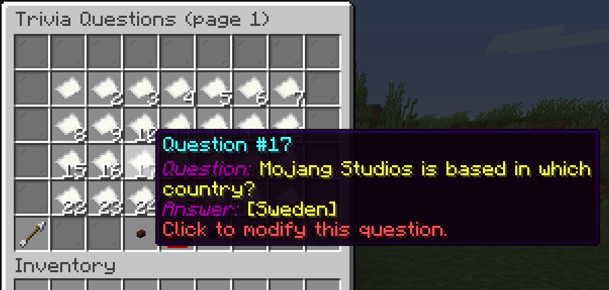
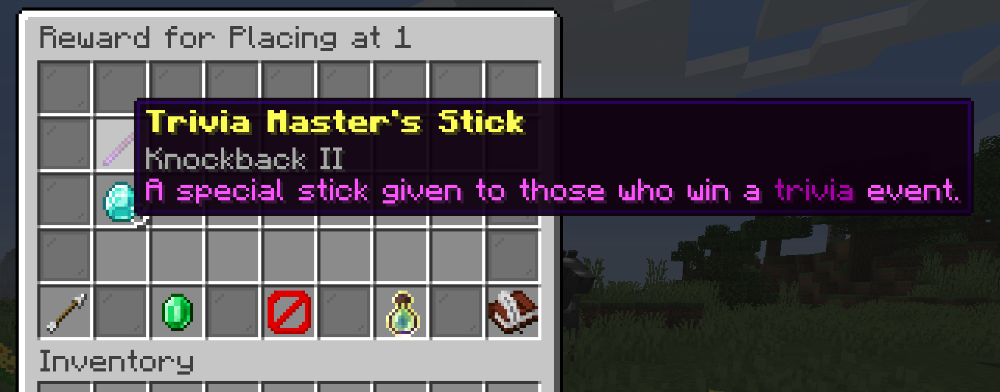
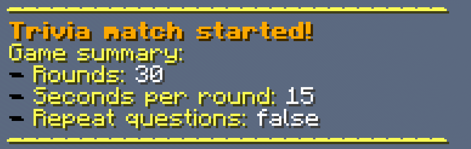
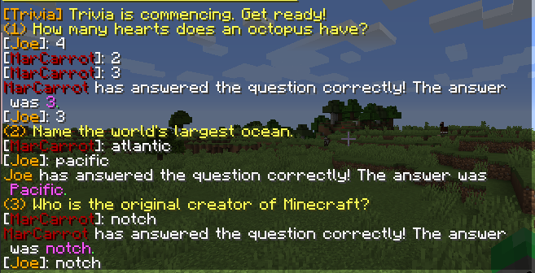
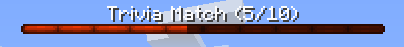
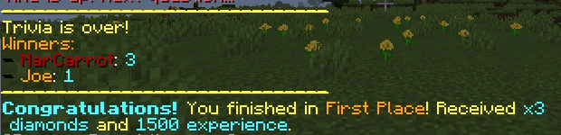

# Trivia-Plugin

## Welcome to Trivia!

With Trivia, you can host a chat game to put your players to the test!
Use an in-game menu to create your own questions/answers and set rewards for winners.
Then, start the game with `/trivia start`, and your questions will start to show up in chat.
The player to answer the question on the screen first wins that round,
and whoever answers the most by the end of the match is the winner and runs off with the rewards.

## Customize Questions and Answers

In trivia, you can view all your questions you created from a graphical menu, as shown below.  

Clicking on a particular question will let you modify the question/answer or remove it entirely.    
Create new questions by clicking on the emerald icon,
and then a chat prompt will show up to set the new question and answer.

## Customize Rewards

It can't be trivia without rewards!

Winners of Trivia will receive any rewards set by you. Like questions, you can view and modify rewards from the menu.
You can configure the rewards for first place, second place, and third place winners. Obviously, you'd want to give the
best rewards to the first place winner!
You can also set up per-round rewards (ender chest), which are given to the person who wins a round each round.

Drag in any items the winner will receive in the empty slots (with any custom name/lore/enchants),
and set money rewards (if vault is installed), experience points, and messages for the winner.
Also, you can set commands as rewards from rewards.yml,
so you can integrate with any other crates/points plugins you have!

The menu will look like this, and for this example, the first place winner will receive this cool stick:

To save changes, simply exit out of the menu, and winners will receive these rewards on the next game.

## Starting the Game

There are three ways a trivia game can start:

- From the menu, where you can adjust a few additional settings before starting
- From the chat, `/trivia start <# of rounds>`
- From scheduled games (more on that later)

When a trivia game starts, it'll give you a summary about the game.

In this example, this trivia match will have a total of 30 questions, 15 seconds to answer each question, and no
repitition of questions.

When Trivia starts, questions will be asked round by round. The first player to enter the answer into chat wins
that round. If no one answers the question within the time limit, the round is skipped. Whoever wins the most amount of
rounds at the end of the game wins Trivia and runs off with the prize!

Here is a screenshot of a game in progress (with 2 players):

During the game, a bar is shown on top of the screen to keep track of the game's progress.

After the game, winners are shown in chat and each winner is given a reward.

## Schedule Games

Trivia can be hosted manually (through the menu or command), but they can also be configured to host automatically in
intervals!

To enable this feature, set `Scheduled games` to true, and set `Scheduled games interval` to the gap in minutes
between hosted games. Finally, set `Scheduled games minimum players` to the amount of players that are needed to be
online for the hosted game to start!

Players can find out when the next game is scheduled to start by running `/trivia schedule`

## Language Support

All messages in this plugin are in English by default, but this plugin features support for other languages by allowing
for custom messages to be set in `messages.yml`. There are placeholders to fill in values with their meanings explained
in the file.

You can also change the colors of the messages to your preferences
using [& color codes](https://wiki.ess3.net/mc/) or [hexadecimal](https://htmlcolorcodes.com/color-picker/) codes. To
use hexadecimal, use the format [#ABCDEF] for the color #ABCEDEF.

## Commands

These are the commands registered for Trivia:

- `/trivia` - opens the menu to either start the game or modify questions & rewards. (*trivia.admin*)
- `/trivia start <# of rounds>` - a shortcut to quickly start a trivia game with # of rounds. Not specifying # will
  default to 10. (*trivia.admin*)
- `/trivia stop` - a command to immediately stop the current trivia match in-progress. (*trivia.admin*)
- `/trivia skip` - a command to skip the current question being asked during a trivia match in-progress.
  (*trivia.admin*)
- `/trivia version` - shows the plugin's version, API version, and author, (*trivia.admin*)
- `/trivia reload` - a command to reload the local plugin files after you've made changes to them. (*trivia.admin*)
- `/trivia stats` - shows the player's stats, including their win count, money and experience earned (*trivia.player*)
- `/trivia schedule` - shows the time until the next scheduled game if it is enabled (*trivia.player*)
- `/trivia help` - a helpful command to get an in-game reference to the commands above. (*trivia.player*)

## Demo

[https://youtu.be/SvhrjbrADu4](https://youtu.be/SvhrjbrADu4)

## Other

### Placeholder API

Features optional PlaceholderAPI support:

| Placeholder                 | Description                                             |
|-----------------------------|---------------------------------------------------------|
| %trivia_game_wins_first%    | Number of player's wins in first place                  |
| %trivia_game_wins_second%   | Number of player's wins in second place                 |
| %trivia_game_wins_third%    | Number of player's wins in third place                  |
| %trivia_game_participation% | Number of player's games participated in                |
| %trivia_round_wins%         | Number of player's round's won (questions answered)     | 
| %money_won%                 | Player's total monetary earnings from Trivia            |
| %experience_won%            | Player's total experience earnings from Trivia          |
| %game_in_progress%          | Says 'true' if a game is in progress, 'false' otherwise | 

### Vault API

Features optional Vault dependency. To give money as a reward, vault must be installed.

### bStats API

This plugin uses bStats. See how many people are using this
plugin: [https://bstats.org/plugin/bukkit/TriviaGUI/7912](https://bstats.org/plugin/bukkit/TriviaGUI/7912)

### Compatibility 

The native version of this plugin is for Spigot 1.17 (shown in /trivia version) and tested in Spigot 1.18.
The plugin was compiled in Java 17, but it should (most likely) compile in Java 11.

